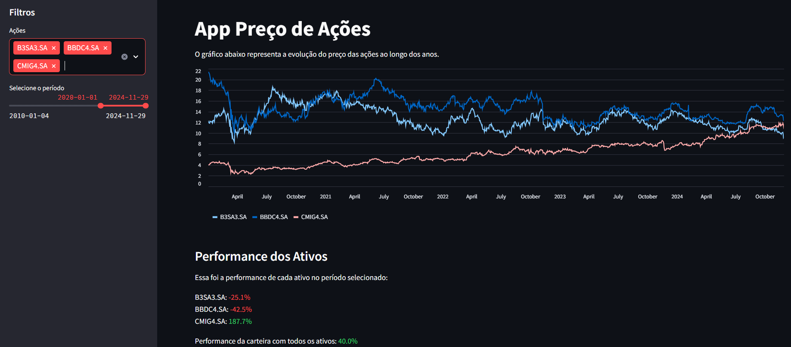

<h1>Acompanhamento de Carteira de Ações</h1>

<p align="center">
  
</p>

<p align="center">
  
</p>

---

## 📖 Tópicos

:small_blue_diamond: [Descrição do projeto](#-descrição-do-projeto)

:small_blue_diamond: [Funcionalidades](#-funcionalidades)

:small_blue_diamond: [Pré-requisitos](#-pré-requisitos)

:small_blue_diamond: [Como execultar a aplicação](#-como-execultar-a-aplicação)

:small_blue_diamond: [Dependencias e libs utilizadas](#-dependencias-e-libs-utilizadas)

:small_blue_diamond: [Autor](#-autor)

---

## 💻 Descrição do projeto

<p align="justify">
  Projeto para analisar o preço de ações e acompanhamento da performance de uma carteira.
</p>

---

## ⚙️ Funcionalidades

:heavy_check_mark: Preço de fechamento de ações.

:heavy_check_mark: Performance de carteira.

:heavy_check_mark: Filtro de ações e período

---

## 🎯 Pré-requisitos

:warning: [Python](https://www.python.org/)

---

## ▶️ Como execultar a aplicação

No terminal, clone o projeto e acesse o diretório do projeto:
```bash
git clone https://github.com/robsonlopesjr/acompanhamento-carteira-acoes

cd acompanhamento-carteira-acoes
```

Crie um ambiente virtual e ative-o:
```python
python -m venv .venv
source .venv/bin/activate  # Para Windows: .venv\Scripts\activate
```

Instale as dependências:
```
pip install -r requirements.txt
```

Execute o Streamlit:
```
streamlit run src/main.py
```

---

## 🛠 Dependências e libs utilizadas

:warning: [Streamlit](https://github.com/streamlit/streamlit)
:warning: [YFinance](https://github.com/ranaroussi/yfinance)

---

## 🎓 Autor

<a href="https://www.linkedin.com/in/robsonlopesjr/">
 
 <br />
 <sub><b>Robson Júnior</b></sub></a>
 <br />

[](https://www.linkedin.com/in/robsonlopesjr)

---